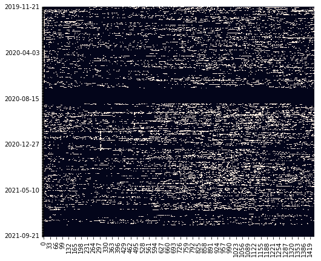
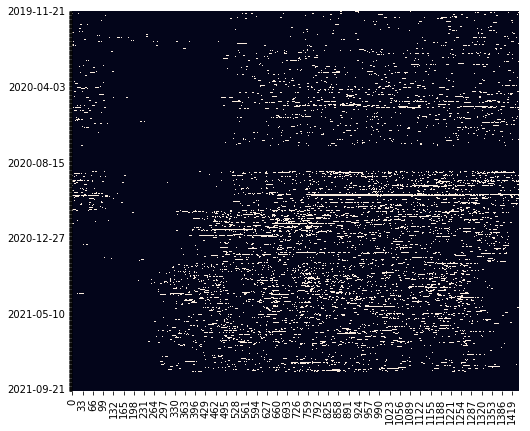

# Database for tracking online of vk.com users

## Usage
``` python
from storage import Storage, Entry

storage = Storage(db_path='test.db', reset=True)
storage.add(minute_id = 0, date = datetime.date.today(), data=[Entry(1, True)])  # vk.com/id1 is online
storage.load(date = datetime.date.today(), uid=1)  # returns [1, 0, 0, ..., 0]
```

## How to run tests
``` bash
PYTHONPATH=$PYTHONPATH:$(pwd) pytest tests/
```

## Задача проекта
Эта оболочка над моим личным проектом для отслеживания циркадных ритмов (или их отсутствия) у себя и друзей. Когда-нибудь это надо будет хорошо оформить, но вот примеры моего сна и сна моего друга.

Белая точка означает онлайн, черная -- оффлайн или даунтайм. По оси абцисс отложен номер минуты в сутках, по оси ординат -- день.

### Мои циркадные ритмы:




### Циркадные ритмы моего друга:



Как видно, сплю я не очень хорошо.